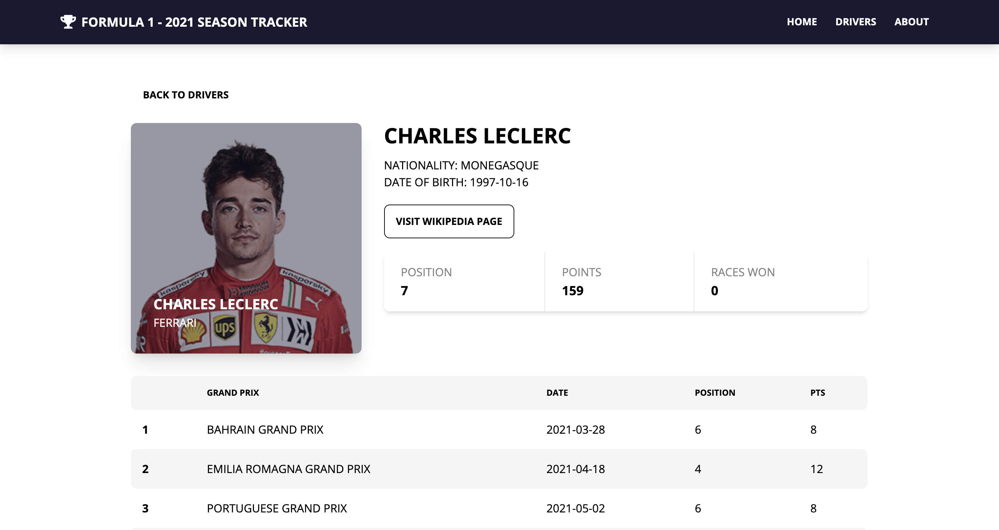

# Formula 1 Season Tracker

## Description

> This Formula 1 Season Tracker helps you keep up with the latest F1 season. Check out your favorite drivers' current standings and the latest race results.
> The initial functionality of the app will allow users to track results from the current season using the Formula One API.

## Technologies

> This app was built using React, Tailwind CSS, and DaisyUI. is app uses the Formula One API to fetch the latest driver data and race results.

## Usage

### `npm install`

### `npm start`

Runs the app in the development mode. 
Open [http://localhost:3000](http://localhost:3000)

### `npm run build`

Builds the app for production to the `build` folder. 
